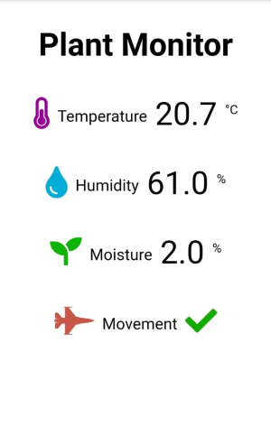

# NodeMCU Plant Monitor
A plant monitor webpage to be used on the NodeMCU (ESP8266).

Based on the tutorial by [Rui Santos](https://randomnerdtutorials.com/esp32-dht11-dht22-temperature-humidity-web-server-arduino-ide/). This project extends the webpage with more elements, such as the output of a moisture sensor.

## Usage
Fill in your WiFi credentials in `arduino_secrets.h.example` and rename the file to `arduino_secrets.h`.
Connect a DHT22, moisture sensor and motion sensor (optionally) to the NodeMCU to the pins specified in `plant-webserver.ino`.
For more information how to do this, see the tutorial linked above.
